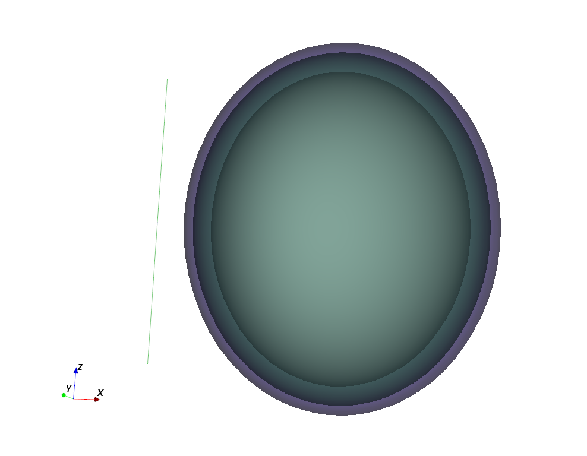
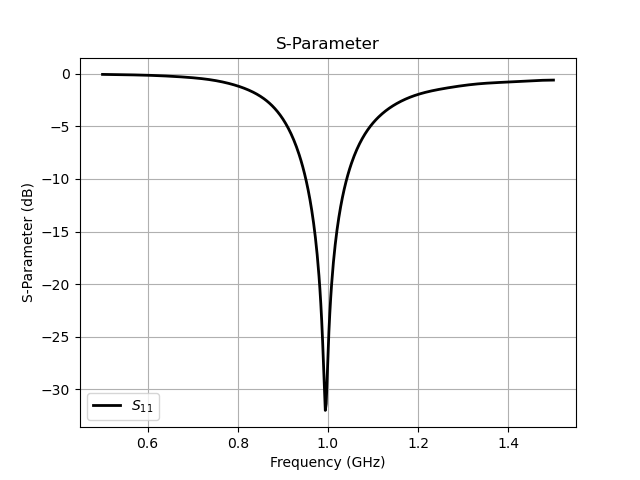
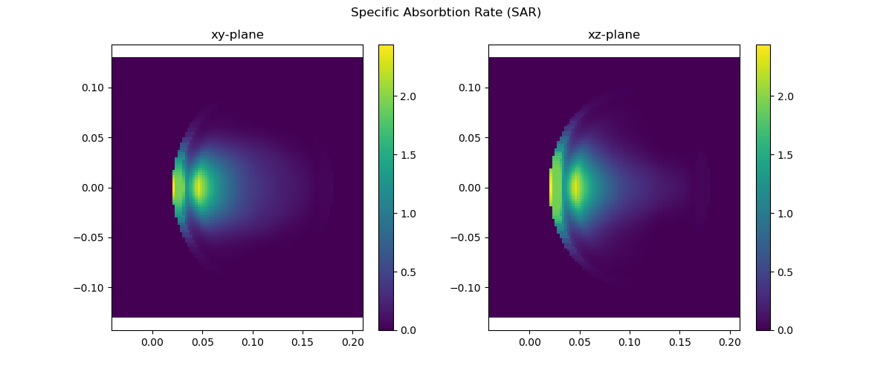

Dipole Antenna Exposure & SAR
==============================

* A half-wave dipole radiating next to a layered head phantom (skin, headbone, brain), used to calculate the Specific Absorption Rate (SAR) and the antenna's power budget.

Introduction
-------------
**This tutorial covers:**

* Setup of a layered ellipsoidal head phantom (skin, headbone, brain)
* Disabling cell-averaging (``CellConstantMaterial``) as required for SAR averaging per IEC/IEEE 62704-1
* Recording a SAR field dump and computing the 10g-averaged SAR
* Calculating the antenna's power budget: accepted, radiated (via NF2FF) and absorbed power

Python Script
-------------
Get the latest version `from git <https://raw.githubusercontent.com/thliebig/openEMS/master/python/Tutorials/Dipole_SAR.py>`_.

.. include:: ./__Dipole_SAR.txt

Images
-------------

    3D view of the half-wave dipole next to the layered head phantom (AppCSXCAD)

    S-Parameter and input impedance of the dipole antenna

    10g averaged SAR distribution on the xy- and xz-plane

