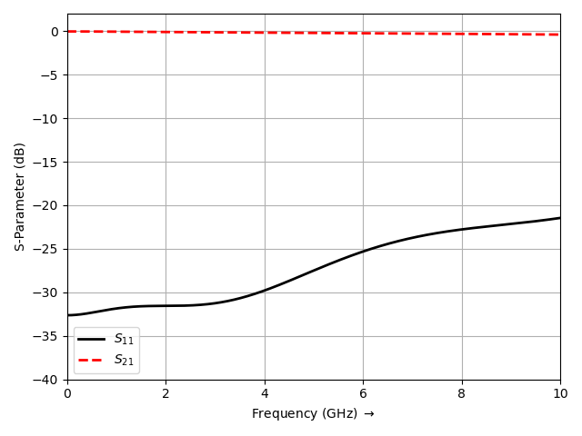

Stripline to Microstrip Line Transition
=========================================

* A vertical transition from a stripline to a microstrip line through a shared substrate, connected by a conducting via.

Introduction
-------------
**This tutorial covers:**

* Setup of a stripline port and a microstrip line port on the same substrate stack
* A plated via connecting the stripline to the microstrip pad through a split ground plane
* Calculate the S-Parameter (S11, S21) of the transition

Python Script
-------------
Get the latest version `from git <https://raw.githubusercontent.com/thliebig/openEMS/master/python/Tutorials/StripLine2MSL.py>`_.

.. include:: ./__StripLine2MSL.txt

Images
-------------

    S-Parameter (S11, S21) of the stripline to microstrip transition

